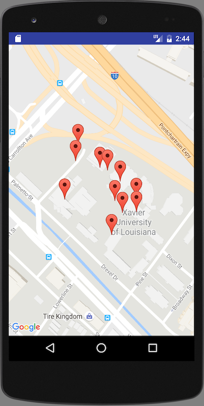
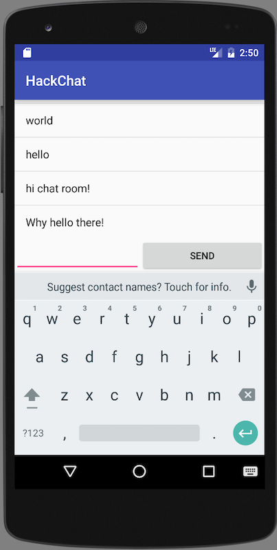

# Unofficial Android Firebase Starter App

This is an app I built as a starting point for my own hacky projects. 

It supports Android API level 19 and higher.

## Features

### `MapsActivity`

- Tap a map to set a marker, and send to Firebase.
- Tap a marker to clear it, and remove from Firebase.
- Markers added / moved / removed from Firebase on other clients appear 
  in real time.

### `ChatActivity`

- Type something and post to a chat room.
- Chat messages are posted to Firebase.
- Chat messages created on other clients are synchronized in real time.

## Using the project

Do this stuff to use this project.

0. Create a [Firebase app](http://firebase.google.com)
0. Copy your `google-services.json` into `/app/`
0. Get an API key for the [Google Maps API for Android](https://developers.google.com/maps/documentation/android-api/)
0. Paste your API key into `app/src/debug/res/values/google_maps_api.xml`

## License and stuff
MIT